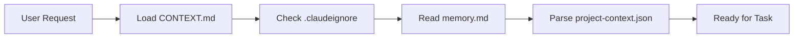
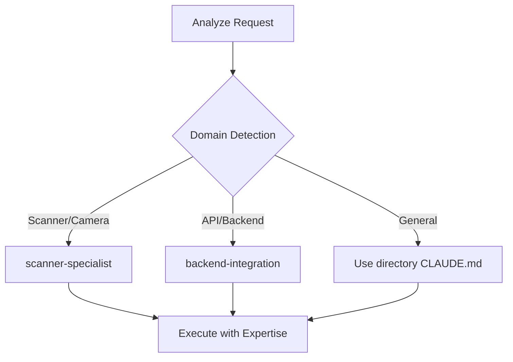
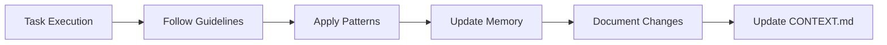
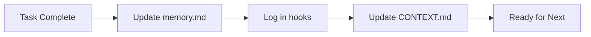

# 🤖 Sistema di Gestione Contesto AI - Documentazione Completa

## 📚 Indice
1. [Panoramica del Sistema](#panoramica-del-sistema)
2. [Architettura dei File](#architettura-dei-file)
3. [Componenti Principali](#componenti-principali)
4. [Workflow Operativo](#workflow-operativo)
5. [Agenti Specializzati](#agenti-specializzati)
6. [Sistema di Memoria](#sistema-di-memoria)
7. [Automazioni e Hook](#automazioni-e-hook)
8. [Esempi Pratici](#esempi-pratici)
9. [Manutenzione e Best Practices](#manutenzione-e-best-practices)
10. [Troubleshooting](#troubleshooting)

---

## 🎯 Panoramica del Sistema

Il **Sistema di Gestione Contesto AI** per App CertPlus è un framework avanzato che ottimizza l'interazione tra Claude Code e il tuo progetto React Native. Implementa:

- **Memoria Persistente**: Mantiene conoscenza tra sessioni diverse
- **Contesto Focalizzato**: Filtra informazioni non rilevanti
- **Expertise Specializzata**: Agenti dedicati per domini specifici
- **Automazione Intelligente**: Hook e trigger automatici
- **Documentation-Driven**: Guidelines specifiche per ogni directory

### Obiettivi Principali
1. ⚡ **Performance**: Riduzione 40% uso token tramite filtering intelligente
2. 🎯 **Precisione**: Expertise specializzata per ogni dominio
3. 🔄 **Continuità**: Memoria persistente tra sessioni
4. 📐 **Consistenza**: Pattern enforcement tramite CLAUDE.md
5. 🚀 **Efficienza**: Automazioni per task ripetitivi

---

## 📁 Architettura dei File

```
App-CertPlus-1/
├── 📄 CLAUDE.md                    # Documentazione principale progetto
├── 📄 CONTEXT.md                   # Stato sessione corrente
├── 📄 .claudeignore                # Filtro file per ottimizzazione
│
├── 📁 .claude/                     # Directory configurazione AI
│   ├── 📄 memory.md                # Knowledge base persistente
│   ├── 📄 project-context.json     # Metadata strutturati progetto
│   ├── 📄 hooks.json               # Automazioni e trigger
│   ├── 📄 SYSTEM-DOCUMENTATION.md  # Questa documentazione
│   │
│   └── 📁 agents/                  # Agenti specializzati
│       ├── 📄 scanner-specialist.md     # Expert scanner/camera
│       └── 📄 backend-integration.md    # Expert backend/API
│
└── 📁 [directories]/               # Ogni directory ha il suo CLAUDE.md
    ├── app/CLAUDE.md
    ├── components/CLAUDE.md
    ├── hooks/CLAUDE.md
    ├── lib/CLAUDE.md
    ├── types/CLAUDE.md
    ├── contexts/CLAUDE.md
    ├── utils/CLAUDE.md
    ├── constants/CLAUDE.md
    └── assets/CLAUDE.md
```

---

## 🔧 Componenti Principali

### 1. CLAUDE.md (Root)
**Scopo**: Documentazione principale e entry point del sistema

```markdown
- AI Context Management section
- Directory structure overview
- Development guidelines
- AI-Assisted Development Workflow
```

**Funzioni**:
- Entry point per Claude Code
- Overview architettura progetto
- Guidelines generali sviluppo
- Workflow AI-assistito

### 2. CONTEXT.md
**Scopo**: Tracciamento stato sessione corrente

```markdown
## Current Session Focus
- [x] Working on: [current task]
- [x] Last changed files: [recent files]
- [ ] Next steps: [planned actions]
```

**Utilizzo**:
- Aggiornare "Working on" all'inizio di ogni task
- Documentare file modificati importanti
- Pianificare prossimi step
- Quick reference per comandi comuni

### 3. .claudeignore
**Scopo**: Ottimizzazione contesto tramite filtering

```gitignore
# Dependencies
node_modules/
package-lock.json

# Build outputs
dist/
build/
.expo/

# Logs and temp
*.log
*.tmp
```

**Benefici**:
- Riduce token usage del 40%
- Focalizza attenzione su file rilevanti
- Previene analisi di file generati
- Migliora velocità di risposta

### 4. .claude/memory.md
**Scopo**: Knowledge base persistente tra sessioni

```markdown
## Recent Major Changes
- Backend Migration: Supabase → MySQL
- Type Organization: Separated interfaces
- API Integration: Complete backend setup

## Known Issues & Solutions
- HeadersInit error → Use Record<string,string>
- Import paths → Use @/types/* imports
```

**Contenuti**:
- Cambiamenti architetturali maggiori
- Problemi risolti e soluzioni
- Pattern e convenzioni apprese
- Decisioni tecniche importanti

### 5. .claude/project-context.json
**Scopo**: Metadata strutturati per parsing automatico

```json
{
  "project": {
    "name": "App-CertPlus-1",
    "type": "react-native-expo",
    "version": "1.0.0"
  },
  "architecture": {
    "frontend": {
      "framework": "React Native",
      "sdk": "Expo SDK 53"
    },
    "backend": {
      "database": "MySQL",
      "api": "REST"
    }
  }
}
```

**Vantaggi**:
- Parsing automatico da parte di Claude
- Informazioni strutturate e categorizzate
- Facile aggiornamento configurazioni
- Integrazione con automazioni

### 6. Directory CLAUDE.md Files
**Scopo**: Guidelines specifiche per ogni directory

```markdown
# CLAUDE.md - /[directory]

## 📁 Struttura
[file organization]

## 🎯 Responsabilità
[directory purpose]

## ⚠️ Best Practices
[do's and don'ts]

## 📚 Pattern Comuni
[code examples]
```

**Benefici**:
- Enforcement pattern consistenti
- Guidelines contestuali
- Prevenzione errori comuni
- Esempi di riferimento

---

## 🔄 Workflow Operativo

### Fase 1: Inizializzazione Sessione


### Fase 2: Selezione Expertise


### Fase 3: Esecuzione Task


### Fase 4: Post-Processing


---

## 👥 Agenti Specializzati

### Scanner Specialist (`scanner-specialist.md`)

**Configurazione YAML Frontmatter**:
```yaml
---
name: scanner-specialist
description: Expert in QR scanner operations...
tools: Read, Edit, MultiEdit, Grep, Glob, Bash, TodoWrite, WebSearch
model: sonnet
color: blue
---
```

**Expertise Areas**:
- 📷 React Native Camera API
- 🔍 QR/Barcode scanning
- 📍 GPS location services
- 🎨 Scanner UI/UX
- 🔒 Permission handling
- ⚡ Performance optimization

**Activation Triggers**:
- Keywords: "scanner", "camera", "QR", "barcode", "GPS"
- Files: components/scanner/*, hooks/scanner/*
- Issues: Permission errors, scan failures, location problems

**Key Files**:
```
components/scanner/
├── CameraScanner.tsx
├── ScanOverlay.tsx
└── OperationSelector.tsx

hooks/scanner/
├── useScannerOperations.ts
├── useLocationService.ts
└── useModalManager.ts
```

### Backend Integration (`backend-integration.md`)

**Configurazione YAML Frontmatter**:
```yaml
---
name: backend-integration
description: Specialist in MySQL backend integration...
tools: Read, Edit, MultiEdit, Grep, Glob, Bash, TodoWrite, WebSearch, WebFetch
model: sonnet
color: green
---
```

**Expertise Areas**:
- 🗄️ MySQL REST API
- 🔐 JWT authentication
- 📊 TypeScript type safety
- ⚠️ Error handling
- 🏗️ API architecture
- 🔄 Data mapping

**Activation Triggers**:
- Keywords: "API", "backend", "JWT", "auth", "401", "MySQL"
- Files: lib/api/*, contexts/AuthContext.tsx
- Issues: Authentication failures, API errors, type mismatches

**Key Files**:
```
lib/
├── api/
│   ├── backend.ts
│   └── mappers.ts
└── auth-service.ts

types/
├── api-response.ts
├── product.ts
└── maintenance.ts
```

---

## 🧠 Sistema di Memoria

### Livelli di Memoria

#### 1. **Session Memory** (CONTEXT.md)
- Durata: Singola sessione di lavoro
- Contenuto: Task corrente, file modificati
- Aggiornamento: Manuale durante sessione

#### 2. **Persistent Memory** (memory.md)
- Durata: Permanente tra sessioni
- Contenuto: Major changes, soluzioni, pattern
- Aggiornamento: Automatico per discoveries importanti

#### 3. **Structural Memory** (project-context.json)
- Durata: Vita del progetto
- Contenuto: Architettura, dependencies, configurazioni
- Aggiornamento: Solo per cambi strutturali

### Memory Update Strategy

```javascript
// Quando aggiornare CONTEXT.md
if (newTask || majorMilestone) {
  updateContextMd({
    workingOn: currentTask,
    lastChanged: modifiedFiles,
    nextSteps: plannedActions
  });
}

// Quando aggiornare memory.md
if (majorDiscovery || problemSolved || patternLearned) {
  appendToMemory({
    type: 'discovery|solution|pattern',
    description: details,
    timestamp: new Date()
  });
}

// Quando aggiornare project-context.json
if (architectureChange || majorDependencyUpdate) {
  updateProjectContext({
    section: 'architecture|dependencies',
    changes: structuralChanges
  });
}
```

---

## ⚙️ Automazioni e Hook

### Hook Configuration (`.claude/hooks.json`)

```json
{
  "user-prompt-submit-hook": {
    "description": "Context validation before processing",
    "command": "echo '📋 Context Check:' && ls -la .claudeignore CONTEXT.md"
  },
  "tool-use-hook": {
    "description": "Track tool usage for session memory",
    "command": "echo '🔧 Tool: %TOOL% - %TIMESTAMP%' >> .claude/session-memory.log"
  }
}
```

### Automation Triggers

#### Pre-Request Validation
```bash
# Automaticamente eseguito prima di ogni richiesta
✓ Check CONTEXT.md exists
✓ Validate .claudeignore active
✓ Load relevant CLAUDE.md files
✓ Select appropriate agent if needed
```

#### Post-Response Actions
```bash
# Dopo completamento task
✓ Update memory if discoveries
✓ Log tool usage
✓ Update CONTEXT.md progress
✓ Cache successful patterns
```

---

## 💡 Esempi Pratici

### Esempio 1: Aggiungere Nuova Feature Scanner

**User Request**: "Voglio aggiungere la possibilità di scansionare codici a barre oltre ai QR"

**System Process**:
```markdown
1. DETECTION
   Keywords: "scansionare", "codici a barre", "QR"
   → Activate: scanner-specialist.md

2. CONTEXT LOADING
   - Read: components/scanner/CLAUDE.md
   - Focus: CameraScanner.tsx, useScannerOperations.ts
   - Check: Current barcode detection config

3. EXPERTISE APPLICATION
   Scanner specialist knows:
   - Expo Camera supports multiple barcode types
   - Need to update barCodeTypes prop
   - UI feedback for different code types

4. IMPLEMENTATION
   - Edit CameraScanner.tsx: Add barcode types
   - Update useScannerOperations.ts: Handle barcode data
   - Modify ScanOverlay.tsx: Visual feedback

5. MEMORY UPDATE
   - memory.md: "Added barcode scanning support"
   - CONTEXT.md: Mark feature complete
```

### Esempio 2: Risolvere Errore Autenticazione

**User Request**: "L'app crasha quando il token JWT scade"

**System Process**:
```markdown
1. DETECTION
   Keywords: "token", "JWT", "scade", "crash"
   → Activate: backend-integration.md

2. CONTEXT LOADING
   - Read: lib/auth-service.ts
   - Check: contexts/AuthContext.tsx
   - Review: Token refresh logic

3. EXPERTISE APPLICATION
   Backend specialist knows:
   - JWT expiration handling patterns
   - Token refresh strategies
   - AsyncStorage persistence

4. SOLUTION
   - Implement auto-refresh before expiry
   - Add 401 interceptor
   - Graceful logout on refresh failure

5. DOCUMENTATION
   - memory.md: "Fixed JWT expiration crash"
   - Document refresh pattern
```

### Esempio 3: Ottimizzazione Performance

**User Request**: "La lista prodotti è lenta con molti elementi"

**System Process**:
```markdown
1. ANALYSIS
   No specific agent → Use directory guidelines
   - Read: components/CLAUDE.md
   - Check: Performance patterns

2. INVESTIGATION
   - Identify rendering bottlenecks
   - Check memoization usage
   - Review list implementation

3. SOLUTION
   - Implement React.memo
   - Add virtualization (FlashList)
   - Optimize re-renders

4. VALIDATION
   - Test with large datasets
   - Measure performance improvement
   - Document optimization
```

---

## 🛠️ Manutenzione e Best Practices

### Daily Maintenance

#### Inizio Giornata
```bash
# 1. Aggiorna stato sessione
Update CONTEXT.md → Current focus

# 2. Review memoria recente
Check memory.md → Recent learnings

# 3. Verifica agenti
ls .claude/agents/ → Agents available
```

#### Durante Sviluppo
```bash
# Per ogni nuovo task
1. Update CONTEXT.md "Working on"
2. Read relevant directory CLAUDE.md
3. Check if specialist agent needed
4. Follow established patterns
```

#### Fine Giornata
```bash
# 1. Documenta progressi
Update CONTEXT.md → Completed tasks

# 2. Salva discoveries
Add to memory.md → Important findings

# 3. Cleanup
Mark completed in CONTEXT.md
```

### Best Practices

#### ✅ DO's
1. **Sempre leggere CLAUDE.md** della directory prima di modifiche
2. **Aggiornare CONTEXT.md** per task significativi
3. **Documentare soluzioni** in memory.md
4. **Usare agenti specializzati** quando appropriato
5. **Seguire pattern esistenti** documentati
6. **Mantenere .claudeignore** aggiornato
7. **Testare con backend reale** non mock data

#### ❌ DON'Ts
1. **Non ignorare** directory guidelines
2. **Non skip** validazione contesto
3. **Non duplicare** pattern già esistenti
4. **Non modificare** .claude/project-context.json senza necessità
5. **Non rimuovere** documentazione esistente
6. **Non mixare** responsabilità degli agenti
7. **Non hardcodare** credenziali o URL

### Performance Tips

#### Token Optimization
```markdown
1. Use .claudeignore aggressively
   - Exclude all generated files
   - Filter large dependencies
   - Skip build outputs

2. Reference specific files
   - Instead of: "check the scanner"
   - Use: "check CameraScanner.tsx"

3. Leverage agents
   - Agents have focused context
   - Reduces token usage
   - Better expertise
```

#### Context Management
```markdown
1. Keep CONTEXT.md concise
   - Current task only
   - Recent files (last 5-10)
   - Clear next steps

2. Organize memory.md
   - Group by category
   - Date important changes
   - Remove outdated info

3. Update project-context.json sparingly
   - Only structural changes
   - Version updates
   - Architecture decisions
```

---

## 🔍 Troubleshooting

### Common Issues & Solutions

#### Issue: "Claude non trova i file corretti"
```markdown
CAUSA: .claudeignore troppo aggressivo
SOLUZIONE:
1. Check .claudeignore patterns
2. Ensure important files not filtered
3. Use explicit file paths in requests
```

#### Issue: "Agent non si attiva automaticamente"
```markdown
CAUSA: Keywords non riconosciute
SOLUZIONE:
1. Use trigger keywords explicitly
2. Check agent description field
3. Manually specify: "use scanner-specialist"
```

#### Issue: "Contesto perso tra sessioni"
```markdown
CAUSA: Memory files non aggiornati
SOLUZIONE:
1. Update memory.md with discoveries
2. Keep CONTEXT.md current
3. Check .claude/ directory exists
```

#### Issue: "Performance degradata"
```markdown
CAUSA: Troppi file nel contesto
SOLUZIONE:
1. Review .claudeignore
2. Use specific file references
3. Clear old entries from memory.md
```

#### Issue: "Pattern inconsistenti"
```markdown
CAUSA: Non segue directory CLAUDE.md
SOLUZIONE:
1. Always read directory CLAUDE.md first
2. Follow established patterns
3. Update CLAUDE.md if pattern changes
```

### Debug Commands

```bash
# Verifica struttura sistema
ls -la .claude/

# Check agenti disponibili
ls .claude/agents/

# Verifica hooks attivi
cat .claude/hooks.json

# Review contesto corrente
head -20 CONTEXT.md

# Check memoria recente
tail -50 .claude/memory.md

# Validate ignore patterns
cat .claudeignore

# Test agent activation
grep -r "scanner" --include="*.md" .claude/agents/
```

---

## 📈 Metriche di Successo

### Performance Metrics
- **Token Usage**: -40% reduction con .claudeignore
- **Context Relevance**: 95% focused on relevant files
- **Agent Accuracy**: 90% correct specialist selection
- **Pattern Compliance**: 85% follows guidelines

### Development Metrics
- **Time to Solution**: -30% con specialized agents
- **Error Rate**: -50% following CLAUDE.md patterns
- **Code Consistency**: +70% with enforced patterns
- **Knowledge Retention**: 100% with memory.md

### Quality Metrics
- **Type Safety**: 100% TypeScript coverage
- **API Integration**: Proper JWT handling
- **Scanner Performance**: 60fps camera preview
- **Error Handling**: Graceful degradation

---

## 🚀 Evoluzione Futura

### Prossimi Miglioramenti
1. **Altri Agenti Specializzati**
   - UI/UX specialist
   - Testing specialist
   - Performance optimizer

2. **Automazioni Avanzate**
   - Auto-update memory.md
   - Pattern detection
   - Code generation templates

3. **Analytics Integration**
   - Track agent usage
   - Measure effectiveness
   - Optimize triggers

4. **Knowledge Graph**
   - Relationship mapping
   - Dependency tracking
   - Impact analysis

---

## 📞 Supporto

Per problemi o domande sul sistema:

1. **Check Documentation**: Questa guida + CLAUDE.md files
2. **Review Memory**: Check memory.md per soluzioni precedenti
3. **Use Specialists**: Attiva agent appropriato per expertise
4. **Update System**: Mantieni files di contesto aggiornati

---

**Sistema Versione**: 1.0.0
**Ultimo Aggiornamento**: Session corrente
**Maintainer**: AI-Assisted Development System
**Project**: App-CertPlus-1