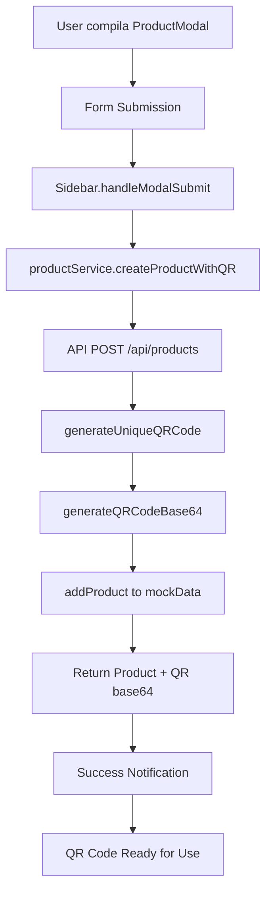

# CLAUDE.md - /src/lib

Libreria di utility functions, configurazioni e dati mockati per l'applicazione.

## 📁 Struttura

```
lib/
├── utils.ts              # Utility functions generali (Tailwind merge, etc.)
├── mock-data.ts          # Dati mockati per sviluppo e demo
├── qr-generator.ts       # Sistema generazione QR code con base64 (NUOVO)
└── validations/          # Schema di validazione Zod
    └── index.ts          # Form validation schemas
```

## 📋 File Descriptions

### utils.ts
**Utility functions** di supporto per l'applicazione:

```typescript
import { clsx, type ClassValue } from "clsx";
import { twMerge } from "tailwind-merge";

// Merge delle classi Tailwind CSS
export function cn(...inputs: ClassValue[]) {
  return twMerge(clsx(inputs));
}
```

**Utilizzo**:
```typescript
import { cn } from "@/lib/utils";

// Combine classi condizionalmente
<div className={cn(
  "base-classes",
  isActive && "active-classes",
  className // prop passata dal parent
)} />
```

### qr-generator.ts ✨ **NUOVO SISTEMA QR CODE**
**Enterprise-grade QR generation** con base64 output per backend integration:

#### Core Features
- **Unique QR ID Generation**: Format `QR{timestamp}` con collision avoidance
- **Base64 Image Generation**: Canvas-based PNG conversion per backend storage
- **Multiple Output Formats**: DataURL, raw base64, Buffer per diverse esigenze
- **Configurable Styling**: Colori, dimensioni, error correction personalizzabili
- **URL Generation**: QR codes puntano a `/public/product/{qr_code}` per accesso pubblico

#### Main Functions
```typescript
// Genera QR code univoco (QR1703123456789)
export function generateUniqueQRCode(): string

// Genera QR come base64 (data:image/png;base64,...)
export async function generateQRCodeBase64(data: string, options?: QRCodeOptions): Promise<string>

// Genera QR Buffer per server-side operations
export async function generateQRCodeBuffer(data: string, options?: QRCodeOptions): Promise<Buffer>

// Sistema completo per prodotti (ID + URL + base64 in una chiamata)
export async function createProductQRCode(productData: {companyId: string}, baseUrl?: string): Promise<QRCodeResult>
```

#### Integration con Product Creation
```typescript
// Esempio utilizzo nel flusso di creazione prodotto
const qrResult = await createProductQRCode({
  companyId: 'company-1'
});

// Risultato:
{
  qr_code: "QR1703123456789",
  qr_url: "http://localhost:3000/public/product/QR1703123456789",
  qr_image_base64: "data:image/png;base64,iVBORw0KGgoAAAANSUhEUgAA...",
  created_at: "2024-12-21T10:30:00Z"
}
```

#### QR Code Options
```typescript
interface QRCodeOptions {
  width?: number;        // Default: 400px
  height?: number;       // Default: 400px
  margin?: number;       // Default: 2
  color?: {
    dark?: string;       // Default: '#000000'
    light?: string;      // Default: '#FFFFFF'
  };
  errorCorrectionLevel?: 'L' | 'M' | 'Q' | 'H'; // Default: 'M'
}
```

### mock-data.ts
**Database mockato** per sviluppo e testing con **CRUD operations integrate**:

#### Entità Disponibili
- **Companies**: Aziende registrate
- **Users**: Utenti (aziende, dipendenti, viewer)
- **Products**: Catalogo prodotti certificati **con QR codes**
- **Maintenance**: Storico interventi e manutenzioni

#### Helper Functions (Read Operations)
```typescript
// Utility per accesso dati
export const getUserById = (id: string) => mockUsers.find(user => user.id === id);
export const getProductById = (id: string) => mockProducts.find(product => product.id === id);
export const getMaintenanceByProductId = (productId: string) =>
  mockMaintenance.filter(maint => maint.productId === productId);
export const getCompanyById = (id: string) => mockCompanies.find(company => company.id === id);

// ✨ NUOVE - QR Code Functions
export const getProductByQRCode = (qrCode: string): Product | null
export const isQRCodeExists = (qrCode: string): boolean
```

#### CRUD Operations ✨ **NUOVO**
```typescript
// Product CRUD
export const addProduct = (productData: Omit<Product, 'id'>): Product
export const updateProduct = (productId: string, updateData: Partial<Product>): Product | null
export const deleteProduct = (productId: string): Product | null

// Maintenance CRUD
export const addMaintenance = (maintenanceData: Omit<Maintenance, 'id'>): Maintenance
export const updateMaintenance = (maintenanceId: string, updateData: Partial<Maintenance>): Maintenance | null
export const deleteMaintenance = (maintenanceId: string): Maintenance | null

// Advanced Filtering
export const getProductsWithFilters = (filters: ProductFilters): Product[]
export const getProductStats = (companyId: string): ProductStatistics
export const getMaintenanceStats = (companyId?: string, productId?: string): MaintenanceStatistics
```

**⚠️ IMPORTANTE**: Questo è solo per sviluppo. Per produzione:
1. Sostituire con vero database (PostgreSQL)
2. ✅ **API routes implementate** (`/api/products` con QR generation)
3. Aggiungere autenticazione e autorizzazioni
4. **QR images storage** su cloud (AWS S3, Cloudinary)
5. Vedi `/FRONTEND_PERFORMANCE_AUDIT_REPORT.md` per dettagli migrazione

#### Struttura Dati

**Companies**:
```typescript
{
  id: "company-1",
  name: "Segnaletica Stradale SRL",
  email: "info@segnaletica.it",
  logo_url: "https://via.placeholder.com/200x80?text=LOGO",
  createdAt: "2024-01-01T00:00:00Z",
  updatedAt: "2024-01-01T00:00:00Z"
}
```

**Users**:
```typescript
{
  id: "user-1",
  email: "boss@segnaletica.it", 
  name: "Mario Rossi",
  role: "company", // 'company' | 'employee' | 'viewer'
  companyId: "company-1",
  isActive: true,
  createdAt: "2024-01-01T00:00:00Z",
  updatedAt: "2024-01-01T00:00:00Z"
}
```

**Products**:
```typescript
{
  id: "product-1",
  tipo_segnale: "Segnale di pericolo",
  anno: 2024,
  forma: "Triangolare", 
  materiale_supporto: "Alluminio",
  spessore_supporto: 2,
  wl: "WL001",
  fissaggio: "Tasselli",
  dimensioni: "60x60cm",
  materiale_pellicola: "Classe II",
  figura_url: "https://via.placeholder.com/300x300?text=Segnale",
  qr_code: "QR001", // Unique identifier
  gps_lat: 45.4642,
  gps_lng: 9.1900,
  companyId: "company-1",
  createdBy: "user-2",
  createdAt: "2024-01-15T10:30:00Z",
  updatedAt: "2024-01-15T10:30:00Z"
}
```

**Maintenance**:
```typescript
{
  id: "maint-1",
  productId: "product-1",
  tipo_intervento: "installazione", // 'installazione' | 'manutenzione' | 'sostituzione' | 'verifica' | 'dismissione'
  note: "Installato regolarmente in via Roma 123",
  foto_urls: ["https://via.placeholder.com/400x300?text=Installazione"],
  userId: "user-2", // Chi ha eseguito l'intervento
  gps_lat: 45.4642,
  gps_lng: 9.1900,
  createdAt: "2024-01-15T10:45:00Z"
}
```

### validations/index.ts
**Schema di validazione Zod** per forms e input:

#### Available Schemas
```typescript
// Schema per login/registrazione
export const loginSchema = z.object({
  email: z.string().email("Email non valida"),
  password: z.string().min(6, "Password deve essere almeno 6 caratteri")
});

// Schema per prodotti
export const productSchema = z.object({
  tipo_segnale: z.string().min(1, "Tipo segnale richiesto"),
  anno: z.number().min(2000).max(new Date().getFullYear() + 5),
  forma: z.string().min(1, "Forma richiesta"),
  dimensioni: z.string().min(1, "Dimensioni richieste"),
  // ... altri campi
});

// Schema per manutenzioni
export const maintenanceSchema = z.object({
  tipo_intervento: z.enum(["installazione", "manutenzione", "sostituzione", "verifica", "dismissione"]),
  note: z.string().optional(),
  // ... altri campi
});
```

**Utilizzo con React Hook Form**:
```typescript
import { useForm } from "react-hook-form";
import { zodResolver } from "@hookform/resolvers/zod";
import { loginSchema } from "@/lib/validations";

const LoginForm = () => {
  const form = useForm({
    resolver: zodResolver(loginSchema),
    defaultValues: {
      email: "",
      password: ""
    }
  });
  
  const onSubmit = (data) => {
    // Data è automaticamente tipato e validato
    console.log(data); // { email: string, password: string }
  };
  
  return (
    <form onSubmit={form.handleSubmit(onSubmit)}>
      {/* Form fields */}
    </form>
  );
};
```

## 🔧 Development Guidelines

### Adding New Utilities

1. **Pure Functions**: Senza side effects
2. **Type Safe**: Completo typing TypeScript
3. **Testable**: Unit tests per logica complessa
4. **Reusable**: Generiche, non specifiche per un component

```typescript
// ✅ GOOD - Pure utility function
export function formatCurrency(amount: number, currency = "EUR"): string {
  return new Intl.NumberFormat("it-IT", {
    style: "currency",
    currency
  }).format(amount);
}

// ✅ GOOD - Type-safe helper
export function getDisplayName<T extends { name?: string }>(
  item: T, 
  fallback = "N/A"
): string {
  return item.name ?? fallback;
}
```

### Extending Mock Data

**Adding new entities**:
```typescript
// In mock-data.ts
export const mockNewEntity: NewEntity[] = [
  {
    id: "new-1",
    // ... properties following type definition
    createdAt: "2024-01-01T00:00:00Z",
    updatedAt: "2024-01-01T00:00:00Z"
  }
];

// Helper function
export const getNewEntityById = (id: string) => 
  mockNewEntity.find(entity => entity.id === id);
```

**Data relationships**:
- Mantenere coerenza negli ID references
- Seguire pattern naming (company-1, user-1, etc.)
- Timestamps in formato ISO string
- UUID-style IDs per realismo

### Validation Schemas

**Adding new schemas**:
```typescript
// Complex validation with custom refinements
export const complexSchema = z.object({
  email: z.string().email(),
  password: z.string().min(8),
  confirmPassword: z.string()
}).refine((data) => data.password === data.confirmPassword, {
  message: "Password non corrispondono",
  path: ["confirmPassword"]
});

// Optional fields with defaults
export const configSchema = z.object({
  theme: z.enum(["light", "dark"]).default("light"),
  notifications: z.boolean().default(true),
  language: z.string().default("it")
});
```

## 🚀 Performance Considerations

### Utility Functions
- Pure functions per tree-shaking ottimale
- Evitare dependencies pesanti
- Memoize expensive computations quando necessario

### Mock Data
- Lazy loading per datasets grandi
- Helper functions ottimizzate (using Map for lookups)
- Consistent data structure per predittibilità

### Validation
- Schema splitting per bundle size
- Async validation quando necessario
- Error message localizzazione

## 📱 Sistema QR Code - Architettura Completa

### 🎯 Overview del Sistema
Il sistema QR code di CertificablePlus è progettato per **generazione automatica**, **storage base64** e **integrazione backend** completa.

### 🔄 Flusso Completo di Creazione Prodotto con QR


### 📊 QR Code Data Flow
1. **Generation**: `QR{timestamp}` format per univocità
2. **URL Creation**: `http://localhost:3000/public/product/{qr_code}`
3. **Image Generation**: Canvas → PNG → Base64 (3-4KB typical size)
4. **Backend Storage**: Base64 string inviato al backend per storage
5. **Frontend Display**: QR disponibile immediatamente per visualizzazione/download

### 🔧 Integration Points

#### API Routes (`/src/app/api/products/route.ts`)
```typescript
POST /api/products
├── Validation dei dati richiesti
├── generateUniqueQRCode()
├── generateQRCodeBase64(qrUrl)
├── addProduct() al mock data
└── Response: { product, qr_image_base64, qr_url }

GET /api/products?filters
├── Filtering per company, tipo, search
└── Response: { data: Product[], total: number }
```

#### Service Layer (`/src/services/product-service.ts`)
```typescript
class ProductService
├── createProduct(data) → ServiceResult<{product, qr_image_base64, qr_url}>
├── getProducts(filters) → ServiceResult<Product[]>
├── updateProduct(id, data) → ServiceResult<Product>
└── deleteProduct(id) → ServiceResult<Product>

// Convenience Functions
├── createProductWithQR(data, user) → Simplified interface
├── getCompanyProducts(companyId, search) → Company-specific
└── transformFormDataToProduct(formData, user) → Form transformation
```

### 📱 Frontend Integration

#### ProductModal → Sidebar Flow
```typescript
// 1. User submits ProductModal
onSubmit={(data) => handleModalSubmit(data, 'Product')}

// 2. Sidebar processes submission
const handleModalSubmit = async (data, type) => {
  if (type === 'Product') {
    const productData = transformFormDataToProduct(data, currentUser);
    const result = await createProductWithQR(productData, currentUser);

    if (result.success) {
      // ✅ QR Code automaticamente generato e salvato
      alert(`✅ Prodotto creato!\nQR: ${result.data.product.qr_code}`);
    }
  }
}
```

#### QRCodeModal Integration
```typescript
// Existing QRCodeModal già integrato per display/download
<QRCodeModal
  isOpen={showQRModal}
  onClose={handleCloseQR}
  product={product} // Include qr_code field
  company={company}
/>

// Features disponibili:
// - QR code display
// - PNG/SVG download
// - Print functionality
// - Sharing via Web Share API
```

### 🎨 QR Code Styling & Options
```typescript
// Default configuration
const DEFAULT_OPTIONS = {
  width: 400,           // 400x400px optimal per stampa
  margin: 2,            // Margin around QR code
  color: {
    dark: '#000000',    // QR code color
    light: '#FFFFFF'    // Background color
  },
  errorCorrectionLevel: 'M' // Medium error correction
};

// Custom options per casi specifici
const customOptions = {
  width: 200,           // Smaller per mobile display
  color: {
    dark: '#2A9D8F',    // Brand color
    light: '#F8F9FA'
  },
  errorCorrectionLevel: 'H' // High per ambienti difficili
};
```

### 📊 Performance & Storage

#### QR Code Size Analysis
```typescript
// Typical sizes per 400x400px QR code:
Base64 DataURL: ~3,900 characters (3.9KB)
Raw Base64:     ~2,900 characters (2.9KB)
PNG Buffer:     ~2,900 bytes
```

#### Storage Strategy
- **Development**: Mock data array in memory
- **Production**: PostgreSQL JSONB field o cloud storage (AWS S3)
- **Caching**: Redis per QR images frequently accessed

### 🔒 Security & Validation

#### QR Code Security
```typescript
// Validation functions
export function isValidQRCodeFormat(qrCode: string): boolean // QR{13+ digits}
export function extractQRCodeTimestamp(qrCode: string): number | null

// Uniqueness guarantee
const generateUniqueQRCode = () => {
  const qrCode = `QR${Date.now()}`;
  if (isQRCodeExists(qrCode)) {
    return `QR${Date.now()}${Math.floor(Math.random() * 1000)}`;
  }
  return qrCode;
}
```

#### Public Access Security
- QR URLs point to `/public/product/{qr_code}` for public access
- No authentication required for QR-based product viewing
- Product details limited to essential info in public view

### 📈 Analytics & Monitoring

#### QR Code Usage Tracking
```typescript
// Available analytics functions
export const getProductStats = (companyId: string) => ({
  totalProducts: number,
  byTipologia: Record<string, number>,
  byYear: Record<number, number>,
  recentProducts: Product[]
});

// Future enhancements:
// - QR scan tracking
// - Geographic scan analytics
// - Mobile/desktop usage stats
// - Popular products by scans
```

## 🔄 Migration Path to Production

### From Mock Data to Real Backend
1. **Database Setup**: PostgreSQL con schema definito + QR code fields
2. ✅ **API Routes**: Next.js API routes implementate (`/api/products`)
3. **Data Fetching**: Server Components per SSR
4. **QR Storage**: Cloud storage (AWS S3) per QR images
5. **Caching**: Redis per performance + QR image caching
6. **Authentication**: NextAuth.js o Supabase Auth
7. **Analytics**: QR scan tracking database

### QR Code Production Enhancements
1. **Batch Generation**: Bulk QR creation per migrations
2. **Custom Domains**: QR URLs con custom domain
3. **Analytics Integration**: QR scan tracking
4. **Mobile Optimization**: Progressive Web App per scanner
5. **Offline Support**: QR data caching per offline viewing

Vedi documentazione completa in `/FRONTEND_PERFORMANCE_AUDIT_REPORT.md` sezione Database.